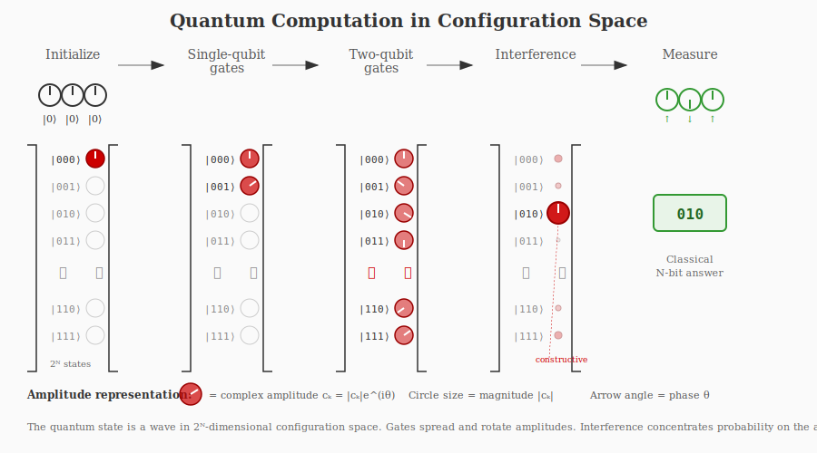

# Lecture 4: Quantum Hardware — Where Are We?

## Recap: What Is a Quantum Computer?

Last lecture, we established the core idea of quantum computing. Let's review.

A quantum computer is a machine that:

1. **Prepares an initial state** — typically all qubits in $|0\rangle$:
$$
|00\cdots0\rangle
$$

2. **Evolves through quantum gates** — unitary operations that cause the wavefunction to spread across configurations. After many gates, the system is in a superposition of all $2^N$ configurations:
$$
|\psi\rangle = c_{000}|000\rangle + c_{001}|001\rangle + c_{010}|010\rangle + \cdots
$$

3. **Exploits interference** — amplitudes flowing through different paths can interfere:
   - Same phase → constructive interference → high probability
   - Opposite phase → destructive interference → low probability

4. **Measures at the end** — the superposition collapses to one classical outcome, a string of 0s and 1s.

**The goal:** Design the gates so that wrong answers interfere destructively and the right answer interferes constructively. When you measure, you're likely to get what you want.


%

```{figure} 01_04_lecture_files/quantum_config_space.svg
:name: quantum-config-fig
:alt: Quantum Configuration Space
:width: 600px
:align: center

This is the caption for the image.
```

%See    {ref}`quantum-config-fig`


---

## Where Are We? The NISQ Era

In 2018, physicist John Preskill coined the term **NISQ**:

> **Noisy Intermediate-Scale Quantum**

This describes the current era of quantum computing:

- **Intermediate-scale:** We have tens to hundreds of qubits. Enough to do *something*, but not enough for the big algorithms like Shor's factoring.

- **Noisy:** The qubits are imperfect. Gate error rates are still too high for error correction to help—adding more qubits for redundancy just adds more noise.

We're past the "proof of concept" stage—quantum computers exist and work. But we're not yet at fault-tolerant, error-corrected quantum computing.

The central question of this lecture: **Why is it so hard, and what are we doing about it?**

---

## Classical Error Correction

Before we tackle quantum errors, let's remember how classical computers handle noise.

### Classical Computers Have Errors Too

You might think classical computers are perfect, but they're not:
- Cosmic rays can flip bits in memory
- Voltage fluctuations can cause errors
- Hard drives and SSDs have read/write errors

The difference is **where** errors occur and how often:

| Component | Error rate | Error correction? |
|-----------|------------|-------------------|
| CPU logic gates | $\sim 10^{-18}$ per operation | No — too rare to bother |
| RAM (DRAM) | $\sim 10^{-15}$ per bit per hour | Sometimes (ECC memory in servers) |
| Hard drives / SSDs | $\sim 10^{-12}$ per bit | Yes — heavy error correction |
| Data transmission | Varies | Yes — checksums detect errors, then retransmit |

The key insight: **CPU logic is essentially perfect**. We only need error correction for storage and transmission, where bits sit idle or travel through noisy channels.

### The Classical Solution: Redundancy

The simplest error correction is repetition. Instead of storing one bit, store three copies:

$$
0 \rightarrow 000, \qquad 1 \rightarrow 111
$$

If one bit flips due to noise:
$$
000 \xrightarrow{\text{error}} 010
$$

You detect the error (one bit disagrees with the others) and correct it by majority vote: two 0s and one 1 → the answer is 0.

This works because classical information can be:
1. **Copied** freely
2. **Measured** without changing it
3. **Compared** to find disagreements

These three properties let us detect and fix errors. But quantum mechanics breaks all of them.

---

## Why Quantum Is Different: The Phase Matters

In a classical computer, information is stored in definite states: the bit is 0 or 1.

In a quantum computer, information is stored in superpositions, and the phase between amplitudes is crucial.

### One Qubit

A single qubit can be in a superposition:
$$
|\psi\rangle = \frac{1}{\sqrt{2}}\left(|0\rangle + e^{i\theta}|1\rangle\right)
$$

The amplitudes have equal magnitude ($1/\sqrt{2}$ each), but the phase $\theta$ encodes information. Different values of $\theta$ represent different quantum states:
- $\theta = 0$: $|0\rangle + |1\rangle$
- $\theta = \pi$: $|0\rangle - |1\rangle$
- $\theta = \pi/2$: $|0\rangle + i|1\rangle$

These are all different states that behave differently under quantum gates. **The phase is information**—and it's exactly what enables interference. The phase determines whether amplitudes add (constructive) or cancel (destructive).

### N Qubits

For $N$ qubits, the state is a superposition over all $2^N$ configurations:
$$
|\psi\rangle = c_{000\cdots0}|000\cdots0\rangle + c_{000\cdots1}|000\cdots1\rangle + \cdots + c_{111\cdots1}|111\cdots1\rangle
$$

Each coefficient $c_i$ is a complex number with a magnitude and a phase. For interference to work correctly, all $2^N$ phases must remain coherent—they must maintain their precise relationships with each other.

If anything scrambles these phases, the interference patterns are destroyed, and the quantum computer becomes useless.

---

## Decoherence: The Enemy

Here is the central challenge of quantum computing:

> **Quantum systems are extremely sensitive to their environment.**

Any interaction with the outside world—a stray photon, a vibrating atom, a fluctuating magnetic field—can disturb the delicate phase relationships in a quantum state.

This is called **decoherence**: the loss of definite phase relationships between configurations.

### The Double-Slit Analogy

Remember the double-slit experiment. A particle goes through both slits simultaneously, and the two paths interfere to create a pattern on the screen.

The interference pattern exists because the particle takes both paths, and the amplitudes from each path combine. Where they're in phase, you get bright bands; where they're out of phase, you get dark bands.

But if you put a detector at one slit to measure "which path" the particle took.

<!-- 
(Sorry these figures are awful. These are all new lectures. If you'd like to help with svg figures please see these [instructions](../resources/figure_instruction.md). ) -->

The interference pattern vanishes. The act of measurement destroys the superposition.

A photon scatters off your qubit and flies away into the room. That photon now carries information about your qubit's state. The universe has "measured" your qubit, even if no human ever looks at that photon.

The same thing happens in a quantum computer. If the environment "measures" your qubit—if any information about the qubit's state leaks out—the superposition is destroyed.

### Three Sources of Error

There are three main ways the environment can ruin your quantum computation:

**1. Measurement by the environment**

Something interacts with your qubit and carries away "which state" information.

Example: A photon scatters off your qubit. The photon's wavelength or direction now depends on the qubit's state. Even if no human looks at that photon, the information has leaked into the environment. The qubit is now entangled with the outside world, and from the qubit's perspective, the superposition has collapsed.

**2. Phase scrambling (pure dephasing)**

The relative phase between $|0\rangle$ and $|1\rangle$ gets randomized, but no information actually leaves the system.

Example: Your qubit sits in a magnetic field that fluctuates slightly over time. The energy difference between $|0\rangle$ and $|1\rangle$ shifts unpredictably, causing the phase to accumulate at a jittery rate. After a while, the phase has drifted to a random value.

No photon escaped. No "measurement" happened. But the phase is now garbage.

**3. Decay / relaxation**

The qubit loses energy to the environment and physically transitions from $|1\rangle$ to $|0\rangle$ (or equilibrates thermally).

Example: An excited atom spontaneously emits a photon and drops to the ground state. The qubit that was in a superposition is now definitely in $|0\rangle$.

All three mechanisms have the same consequence: the interference patterns are scrambled, and the quantum computation fails. The race is on—you must finish your computation before decoherence destroys your quantum state.

---

## The Quantum Error Correction Problem

Given that errors are inevitable, can we correct them like we do classically?

### Why Classical Strategies Fail

The classical approach—copy the data, check for errors, fix by majority vote—fails for two fundamental reasons:

**1. The No-Cloning Theorem**

In quantum mechanics, you cannot copy an unknown quantum state. There is no machine that takes $|\psi\rangle$ as input and produces $|\psi\rangle \otimes |\psi\rangle$ as output.

This isn't a technological limitation—it's a theorem. If you could clone quantum states, you could violate fundamental principles like the uncertainty principle and no faster-than-light communication.

So we can't just make three copies of our qubit and do majority vote.

**2. Measurement Destroys Superposition**

To check if a classical bit has flipped, you just look at it. Looking at a bit doesn't change it.

But measuring a qubit in superposition collapses it to $|0\rangle$ or $|1\rangle$. The very act of "checking for errors" destroys the quantum information you're trying to protect.

### The Error Rate Problem

Quantum gates come in two types: **single-qubit gates** (rotating one qubit) and **two-qubit gates** (entangling two qubits).

Single-qubit gates can be extremely good—fidelities of 99.99% or better (four nines). You're just shining a pulse of light or microwaves on one atom. Not much can go wrong.

Two-qubit gates are the hard part. Here's the fundamental tension:

> To have long-lived, coherent qubits, you want them completely isolated from everything.
>
> To do a two-qubit gate, you need two qubits to interact with each other—but nothing else.

You need to briefly turn on a controlled interaction between exactly two qubits, then turn it off completely. Any coupling to the environment, any imperfection in the interaction, causes errors.

Current two-qubit gate fidelities are around 99%–99.9% (two to three nines)—roughly 10 to 100 times worse than single-qubit gates. This is improving rapidly, with the best systems now reaching 99.99%.

A useful quantum algorithm might require millions of gates. Even at 99.9% fidelity per gate, errors compound rapidly. This is why error correction is essential.

### The Solution: Quantum Error Correction

Despite the obstacles of no-cloning and measurement collapse, quantum error correction is possible. The breakthrough, developed in the 1990s:

Encode one **logical qubit** across multiple **physical qubits** in such a way that you can detect errors without measuring the encoded information.

> **Physical qubit:** A single hardware device—one trapped ion, one superconducting circuit, one atom.

> **Logical qubit:** An error-corrected qubit encoded across several physical qubits.

How does this avoid the measurement problem? The trick is to measure *correlations* (called "syndromes") rather than the qubits themselves.

Here's the intuition. Suppose you encode your logical qubit across several physical qubits. You add extra "ancilla" qubits that get entangled with your data qubits in a clever way. When you measure the ancilla, you learn things like: "Did qubits 1 and 2 have the same parity (both 0 or both 1)?" and "Did qubits 2 and 3 have the same parity?"

If an error flips one of your qubits, the parity checks will fail, telling you *which* qubit flipped—without ever revealing what the actual qubit values are. You can then correct the error.

The overhead depends on your physical error rate and the code you use. Early estimates suggested ~1000 physical qubits per logical qubit, but recent theoretical advances (especially new codes like qLDPC) have dramatically reduced this. With high-fidelity gates (~99.9%), you might need only **10–100 physical qubits per logical qubit**. Companies like QuEra are pursuing schemes where small groups of atoms encode logical qubits directly.

The key threshold: if your physical error rate is below ~1%, adding more physical qubits for error correction makes things *better*. Above threshold, more qubits just means more noise.

We're right at this threshold now—which is why the push for higher gate fidelity is so important.

---

## Quantum Hardware Platforms

There are several competing approaches to building physical qubits. Each has different strengths and weaknesses. No one knows which will "win"—they may coexist for different applications.

### Superconducting Qubits

**Companies:** IBM, Google, Rigetti, IQM

Superconducting qubits are built from electrical circuits, but with a quantum twist. The key is to use superconducting metals—typically aluminum—which conduct electricity with zero resistance. No resistance means no energy loss, which is essential for maintaining fragile quantum states.

Start with a simple LC circuit: a capacitor and an inductor connected in a loop. This is a harmonic oscillator for electrical current—the charge sloshes back and forth between the capacitor plates at a resonant frequency, just like a mass on a spring. Quantum mechanically, this oscillator has discrete energy levels, evenly spaced like a ladder.

The problem is that a harmonic oscillator has *too many* levels. If you try to use the bottom two rungs as your $|0\rangle$ and $|1\rangle$, a pulse meant to drive $|0\rangle \to |1\rangle$ might accidentally push you up to $|2\rangle$ or higher. You can't address just two levels.

The solution is to replace the inductor with a **Josephson junction**: a thin insulating barrier (just a few atoms thick) sandwiched between two superconductors. The junction acts as a nonlinear inductor. This breaks the even spacing of the energy levels—the ladder rungs become unevenly spaced. Now the frequency for $|0\rangle \to |1\rangle$ is different from $|1\rangle \to |2\rangle$, and you can selectively address just the qubit transition. This is called an anharmonic oscillator, and the resulting qubit is called a **transmon**.

What are the physical qubit states? In a superconductor, electrons pair up into "Cooper pairs" that move without resistance. The $|0\rangle$ and $|1\rangle$ states of a transmon correspond to different numbers of Cooper pairs that have quantum-tunneled across the Josephson junction. It's a collective excitation of the superconducting condensate.

The whole circuit must be cooled to about 15 millikelvin—colder than outer space—using a dilution refrigerator. At this temperature, thermal fluctuations are negligible compared to the qubit energy spacing.

[FIGURE: Superconducting qubit circuit and energy levels]

**Gates:**
- **Single-qubit gates:** Microwave pulses at the qubit's resonant frequency (~5 GHz) rotate the state on the Bloch sphere. Gate time ~20 ns.
- **Two-qubit gates:** Neighboring qubits are coupled through a resonator or tunable coupler. Turning on the coupling allows energy exchange, creating entanglement. Gate time ~50–200 ns.

**State of the art (2025–2026):**
- Single-qubit gate fidelity: ~99.9%
- Two-qubit gate fidelity: ~99.5% (median), up to ~99.9% on best qubit pairs
- Coherence times: ~100–600 μs
- Largest systems: IBM has 1000+ physical qubits; Google Willow has 105 high-quality qubits
- Google demonstrated error correction below threshold (logical qubits improve as code distance increases)

**Advantages:**
- Very fast gates (~20–100 ns)
- Fabricated using standard lithography—leverages semiconductor industry
- Flexible chip design

**Disadvantages:**
- Requires extreme cooling (dilution refrigerators are expensive and complex)
- Each qubit is slightly different due to fabrication variation
- Relatively short coherence times compared to atoms
- Nearest-neighbor connectivity on chip (long-range coupling is harder)

---

### Trapped Ions

**Companies:** IonQ, Quantinuum, Oxford Ionics (now part of IonQ)

An ion is just an atom with one electron removed, leaving it with a net positive charge. Because it's charged, you can push it around with electric fields—and crucially, you can trap it in place using oscillating electric fields (called a Paul trap or linear trap). A typical trapped-ion quantum computer holds a row of ions suspended in vacuum, spaced a few micrometers apart, floating in an electromagnetic "bottle."

The qubit is encoded in the internal states of each ion. Like the hydrogen atom you studied in intro quantum, the electron in an ion has discrete energy levels. Typically, we use two very long-lived states—either two hyperfine ground states (split by the interaction between the electron and nuclear spin) or two levels connected by an optical transition. Call them $|0\rangle$ and $|1\rangle$. The energy difference corresponds to a microwave or optical frequency.

The beautiful thing about ions is that every ion of the same species is exactly identical. There's no fabrication variation, no defects. Nature gives you perfect qubits for free. Furthermore, isolated atoms in vacuum have very long coherence times—seconds to minutes—because there's almost nothing for them to interact with.

Single-qubit gates are straightforward: shine a laser (or microwave) pulse tuned to the $|0\rangle \leftrightarrow |1\rangle$ transition. The pulse rotates the qubit state, just like an NMR pulse rotates a nuclear spin.

Two-qubit gates are more subtle. The ions don't naturally interact—they're just sitting there, each in its own potential well. But they *are* connected through something: the collective motion of the ion chain. The ions repel each other electrostatically, so if you push one ion, the whole chain responds. The vibrational modes of the chain—the phonons—act as a quantum bus that can transfer information between ions.

Here's how a two-qubit gate works (the Mølmer-Sørensen gate): You shine laser beams that couple the ions' internal states to the collective motion. The first ion's spin gets entangled with the phonon mode; then the phonon mode gets entangled with the second ion's spin. With a carefully designed pulse, the motion disentangles at the end, but the two spins remain entangled. It's as if you shook the lattice in a precise way that correlated the two spins without leaving any trace in the motion.

%[FIGURE: Trapped ion chain and phonon-mediated interaction]

**State of the art (2025–2026):**
- Single-qubit gate fidelity: >99.99%
- Two-qubit gate fidelity: **99.99%** (IonQ, October 2025—world record)
- Quantinuum Helios: 98 qubits, 99.92% two-qubit fidelity
- Coherence times: seconds to minutes
- All-to-all connectivity (any qubit can interact with any other by shuttling ions)

**Advantages:**
- Highest gate fidelities of any platform
- Very long coherence times
- Every qubit is identical
- Flexible connectivity (can rearrange ions by shuttling them around the trap)

**Disadvantages:**
- Slow gate times compared to superconducting (~1000× slower)
- Difficult to scale beyond ~100 ions in a single trap
- Complex laser systems and ultra-high vacuum requirements
- Ion shuttling takes time

---

### Neutral Atoms

**Companies:** QuEra, Pasqal, Atom Computing

Neutral atoms are the newest platform but are generating enormous excitement. The idea is similar to trapped ions—use individual atoms as qubits, taking advantage of the fact that all atoms of the same species are identical. But there's a key difference: neutral atoms have no net charge, so you can't trap them with electric fields.

Instead, we use **optical tweezers**: tightly focused laser beams that create a tiny potential well through the AC Stark effect. An atom feels a force pulling it toward the bright spot at the laser focus. By creating an array of these focused beams (using a spatial light modulator), you can trap hundreds or thousands of individual atoms in a precisely controlled grid. And you can rearrange them dynamically—move atoms around to put them where you need them.

The qubit is encoded in long-lived internal states of the atom, typically hyperfine ground states (like in ions) or nuclear spin states. These have coherence times of seconds because ground-state atoms barely interact with anything. The atoms just sit there in their tweezers, minding their own business.

Single-qubit gates are similar to trapped ions: shine a laser or microwave pulse that drives the $|0\rangle \leftrightarrow |1\rangle$ transition.

Two-qubit gates are where neutral atoms get interesting. In their ground states, neutral atoms essentially don't interact—they're too far apart and have no charge. To create entanglement, we temporarily excite the atoms to **Rydberg states**: extremely high-energy states where the electron orbits far from the nucleus.

A Rydberg atom is huge—the electron can be thousands of times farther from the nucleus than in the ground state. This gives the atom an enormous electric dipole moment. Two nearby Rydberg atoms interact very strongly through the van der Waals force between their dipoles.

This leads to a remarkable effect: the **Rydberg blockade**. If one atom is excited to a Rydberg state, the interaction shifts the energy levels of nearby atoms so much that they *can't* be excited to the Rydberg state—the laser is now off-resonant. This "blockade" is the basis for two-qubit gates: whether one atom can be excited depends on the state of its neighbor, giving you conditional logic.

The Rydberg states are short-lived (they decay in ~100 μs), so you have to do the gate quickly and return to the ground state. But the ground states are very long-lived, so you can store qubits safely between gates.

%[FIGURE: Optical tweezer array and Rydberg interaction]

**State of the art (2025–2026):**
- Single-qubit gate fidelity: >99.9%
- Two-qubit gate fidelity: ~99.5% (demonstrated on 60 atoms in parallel)
- **Largest arrays: 6,100 qubits** (Caltech, September 2025)—far more than any other platform
- Coherence times: ~1–10 seconds in ground states; Rydberg states are short-lived (~100 μs)
- Demonstrated error correction and logical qubit operations

**Advantages:**
- Massive scalability—can trap thousands of atoms with optical tweezers
- Flexible, reconfigurable arrays (atoms can be moved)
- All atoms are identical
- No cryogenics required (operates near room temperature with laser cooling)
- Native multi-qubit gates possible via Rydberg blockade

**Disadvantages:**
- Rydberg states are short-lived—must do gates quickly
- Atom loss during computation (atoms can escape tweezers)
- Two-qubit fidelity still behind trapped ions
- Technology is newer and less mature

---

### Summary Table

| Platform | Qubits (2025) | Gate speed | $T_2$ | 2Q fidelity | Key advantage |
|----------|---------------|------------|-------|-------------|---------------|
| Superconducting | ~100-1000 | ~50 ns | ~100-600 μs | ~99.5% | Fast gates, scalable fab |
| Trapped ions | ~50-100 | ~10-100 μs | seconds-minutes | **99.99%** | Highest fidelity |
| Neutral atoms | **~1000-6000** | ~1 μs | ~1-10 s | ~99.5% | Massive scale, flexibility |

---

## What's Next?

We are in a pivotal moment. The key milestones:

**Where we are now:**
- NISQ era: tens to hundreds of noisy qubits
- Error correction demonstrated but not yet practical
- Gate fidelities approaching the ~99.9% threshold needed for useful error correction

**Near-term (2026-2028):**
- Systems with hundreds of high-quality physical qubits
- First demonstrations of useful logical qubits with real error suppression
- Hybrid classical-quantum algorithms for chemistry, optimization, machine learning

**Medium-term (2029-2035):**
- Fault-tolerant quantum computers with thousands of logical qubits
- Breaking RSA encryption becomes possible (with ~1 million physical qubits at current error rates)
- Quantum simulation of complex molecules for drug discovery and materials science

**The race:**
- Superconducting systems are betting on fast iteration and semiconductor-style scaling
- Trapped ions are betting on quality over quantity—fewer qubits but near-perfect operations
- Neutral atoms are betting on massive parallelism and flexibility

All three approaches have crossed important thresholds in the past two years. The question is no longer "can we build a quantum computer?" but "how soon can we build a *useful* one?"

---

## Summary

1. **Decoherence** is the fundamental enemy—any interaction with the environment (measurement, phase scrambling, or decay) destroys the quantum information needed for interference.

2. **Classical error correction** uses redundancy and majority voting. This works because classical bits can be copied and measured freely.

3. **Quantum error correction** is harder: no-cloning prevents copying, and measurement destroys superposition. The solution is encoding logical qubits across multiple physical qubits and measuring only error syndromes (correlations), not the qubits themselves.

4. **Single-qubit gates** can reach 99.99% fidelity. **Two-qubit gates** are harder (~99–99.9%) because you need controlled interaction while maintaining isolation—this is the key challenge.

5. **Three main platforms** are competing:
   - **Superconducting:** LC circuits with Josephson junctions create anharmonic oscillators; fast gates but needs extreme cooling
   - **Trapped ions:** Charged atoms in electromagnetic traps; phonon-mediated gates give highest fidelity but slow
   - **Neutral atoms:** Optical tweezers hold atoms; Rydberg interactions enable gates; massive scalability

6. **We are at the threshold.** Error correction is starting to work. Fault-tolerant quantum computing is likely 5–10 years away.

---

## Homework: Quantum Hardware Industry Report

In this assignment, you will research two quantum computing companies using different hardware platforms and write a 2–3 page report (single-spaced). 

**A note on process:** A report like this would take many hours to write from scratch. I encourage you to use AI assistants (Claude, ChatGPT, etc.) to help you. Use them to explain technical jargon, summarize web pages, and draft sections of your report. The goal is to learn how the technology works and practice translating technical claims into accessible language—not to spend 10 hours reading whitepapers. My goal is for you to spend  ~2-3 hours on this.  

Be skeptical of both company marketing and AI outputs. When in doubt, cross-reference.

**Choose one company from two different platforms:**

| Superconducting | Trapped Ions | Neutral Atoms |
|-----------------|--------------|---------------|
| IBM | IonQ | QuEra |
| Google | Quantinuum | Pasqal |
| Rigetti | | Atom Computing |

**For each company, here are examples of questions you could try to answer:**

*Technology:*
- What type of qubit do they use? What physical system encodes the $|0\rangle$ and $|1\rangle$?
- How do they implement single-qubit gates? Two-qubit gates?
- What are their reported gate fidelities (single-qubit and two-qubit)?
- How many physical and logical qubits do their current systems have?
- Have they demonstrate error correction?
- Do they have cloud access to the quantum computer?


*Roadmap:*
- What are they promising for 2026?  2030?
- How many qubits? What fidelities? Logical qubits?
- What applications are they targeting (optimization, chemistry, machine learning, cryptography)?

*Business and ecosystem:*
- How much funding have they raised? Are they public or private?
- Who are their major partners or customers?

**Deliverable:**

Write a 2–3 page report (single-spaced) aimed at a non-physicist—for example, a business analyst, investor, or policy maker trying to understand whether quantum computing will affect their industry in the next 5 years.

Your report should include:
- A plain-language summary of each company's technology
- Your assessment of the credibility of their roadmaps
- A conclusion: which approach seems more promising, and for what applications?

**Useful starting points:**
- IBM Quantum: https://www.ibm.com/quantum
- Google Quantum AI: https://quantumai.google/
- IonQ: https://ionq.com/
- Quantinuum: https://www.quantinuum.com/
- QuEra: https://www.quera.com/
- Pasqal: https://www.pasqal.com/


